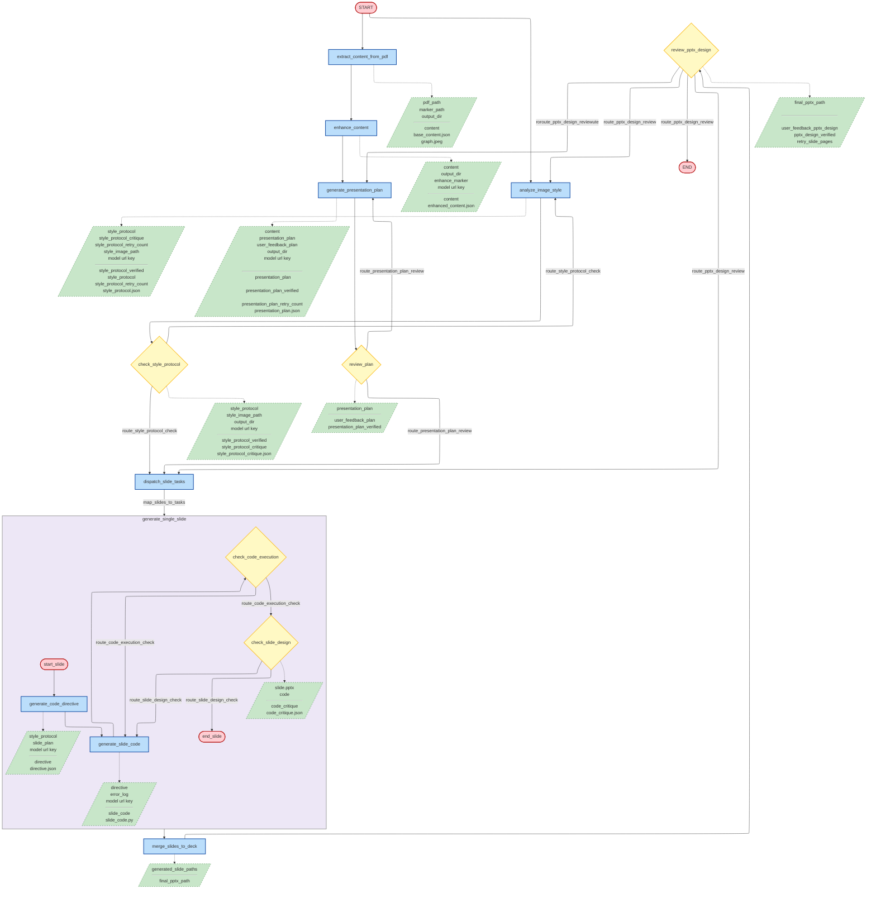

```mermaid
%%{init: {"flowchart": {"defaultRenderer": "elk"}} }%%

graph TD
    %% --- 内容解析部分 ---
    START([START]) --> extract_content_from_pdf
    extract_content_from_pdf --> enhance_content
    enhance_content --> generate_presentation_plan

    extract_content_from_pdf -.-> io_ecfp[/"
        pdf_path
        marker_path
        output_dir
        <hr> content
        base_content.json
        graph.jpeg
    "/]
    enhance_content -.-> io_ec[/"
        content
        output_dir
        enhance_marker
        model url key
        <hr> content
        enhanced_content.json
    "/]

    
    %% --- 风格分析部分 ---
    START --> analyze_image_style
    analyze_image_style --> check_style_protocol{check_style_protocol}
    check_style_protocol --route_style_protocol_check--> analyze_image_style
    check_style_protocol --route_style_protocol_check--> dispatch_slide_tasks

    analyze_image_style -.-> io_ais[/"
        style_protocol
        style_protocol_critique
        style_protocol_retry_count
        style_image_path
        model url key
        <hr> style_protocol_verified
        style_protocol
        style_protocol_retry_count        
        style_protocol.json    
    "/]
    check_style_protocol -.-> io_csp[/"
        style_protocol
        style_image_path
        output_dir
        model url key
        <hr> style_protocol_verified
        style_protocol_critique
        style_protocol_critique.json    
    "/]
    
    %% --- 规划演示部分 ---
    generate_presentation_plan --> review_plan{review_plan}
    review_plan --route_presentation_plan_review--> generate_presentation_plan
    review_plan --route_presentation_plan_review--> dispatch_slide_tasks

    generate_presentation_plan -.-> io_gpp[/"
        content
        presentation_plan
        user_feedback_plan
        output_dir
        model url key
        <hr> presentation_plan
        presentation_plan_verified
        presentation_plan_retry_count
        presentation_plan.json
    "/]
    review_plan -.-> io_rp[/"
        presentation_plan
        <hr> user_feedback_plan
        presentation_plan_verified   
    "/]
    
    %% --- 生成 PPT 部分 ---
    dispatch_slide_tasks --map_slides_to_tasks--> generate_single_slide
    
    %% 子图：生成单页 Slide
    subgraph generate_single_slide
        start_slide([start_slide]) --> generate_code_directive
        generate_code_directive --> generate_slide_code
        generate_slide_code --> check_code_execution{check_code_execution}
        check_code_execution --route_code_execution_check--> generate_slide_code
        check_code_execution --route_code_execution_check--> check_slide_design{check_slide_design}
        check_slide_design --route_slide_design_check--> generate_slide_code
        check_slide_design --route_slide_design_check--> end_slide([end_slide])

        generate_code_directive -.-> io_gcd[/"
            style_protocol
            slide_plan
            model url key
            <hr> directive
            directive.json   
        "/]
        generate_slide_code -.-> io_gc[/"
            directive
            error_log
            model url key
            <hr> slide_code
            slide_code.py  
        "/]
        check_slide_design -.-> io_csd[/"
            slide.pptx
            code
            <hr> code_critique
            code_critique.json
        "/]
    end

    
    %% --- 聚合审查 ---
    generate_single_slide --> merge_slides_to_deck
    merge_slides_to_deck --> review_pptx_design{review_pptx_design}
    review_pptx_design --route_pptx_design_review--> END([END])
    review_pptx_design --route_pptx_design_review--> analyze_image_style
    review_pptx_design --roroute_pptx_design_reviewute--> generate_presentation_plan
    review_pptx_design --route_pptx_design_review--> dispatch_slide_tasks

    merge_slides_to_deck -.-> io_mstd[/"
        generated_slide_paths
        <hr> final_pptx_path 
    "/]
    review_pptx_design -.-> io_rpd[/"
        final_pptx_path
        <hr> user_feedback_pptx_design
        pptx_design_verified
        retry_slide_pages
    "/]

    %% =================样式定义区=================
    
    %% 1. 开始/结束节点 (红色填充)
    classDef startEndNode fill:#ffcdd2,stroke:#b71c1c,stroke-width:2px;
    
    %% 2. 处理节点 (蓝色填充)
    classDef processNode fill:#bbdefb,stroke:#0d47a1,stroke-width:2px;
    
    %% 3. 逻辑判断节点 (黄色填充)
    classDef logicNode fill:#fff9c4,stroke:#fbc02d,stroke-width:2px;
    
    %% 4. 数据注释节点 (绿色填充)
    classDef dataAnnotationNode fill:#c8e6c9,stroke:#2e7d32,stroke-width:1px,stroke-dasharray: 4 4;

    %% 5. 子图区域 (淡紫色填充)
    style generate_single_slide fill:#ede7f6,stroke:#9e9e9e,stroke-width:2px

    %% =================样式应用区=================

    %% 应用红色 (Start/End)
    class START,END,start_slide,end_slide startEndNode;   

    %% 应用蓝色 (Process) 
    class extract_content_from_pdf,enhance_content,generate_presentation_plan,analyze_image_style,dispatch_slide_tasks,merge_slides_to_deck,generate_code_directive,generate_slide_code processNode;

    %% 应用黄色 (Logic)
    class check_style_protocol,review_plan,review_pptx_design,check_code_execution,check_slide_design logicNode;
    
    %% 应用绿色 (Data)
    class io_ecfp,io_ec,io_ais,io_csp,io_gpp,io_rp,io_gcd,io_gc,io_csd,io_mstd,io_rpd dataAnnotationNode;
```